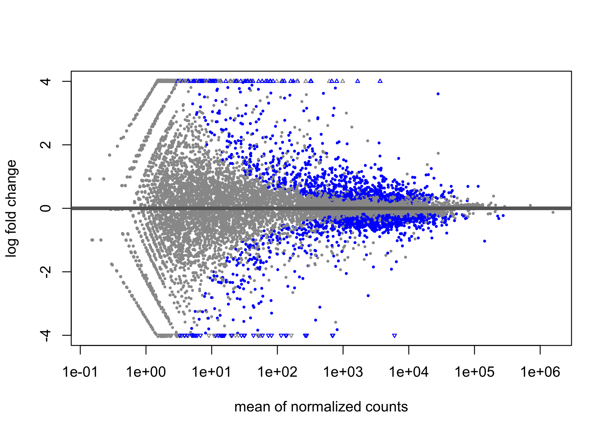
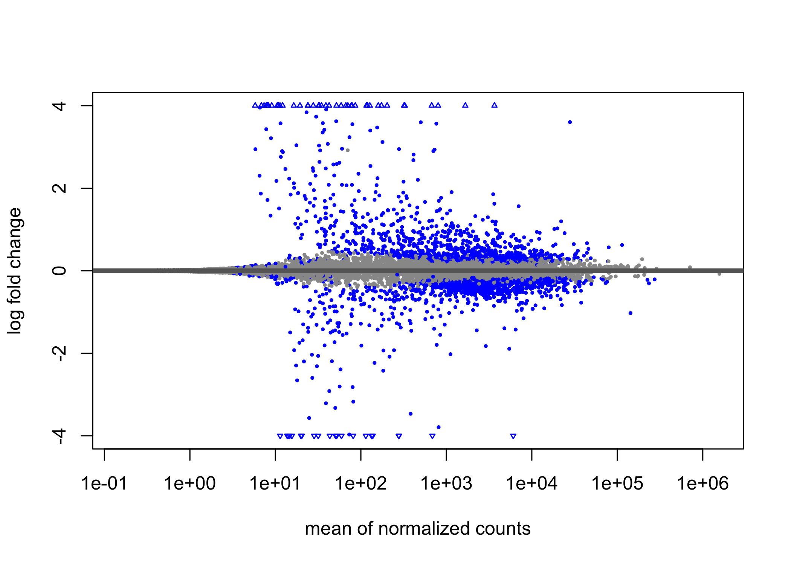
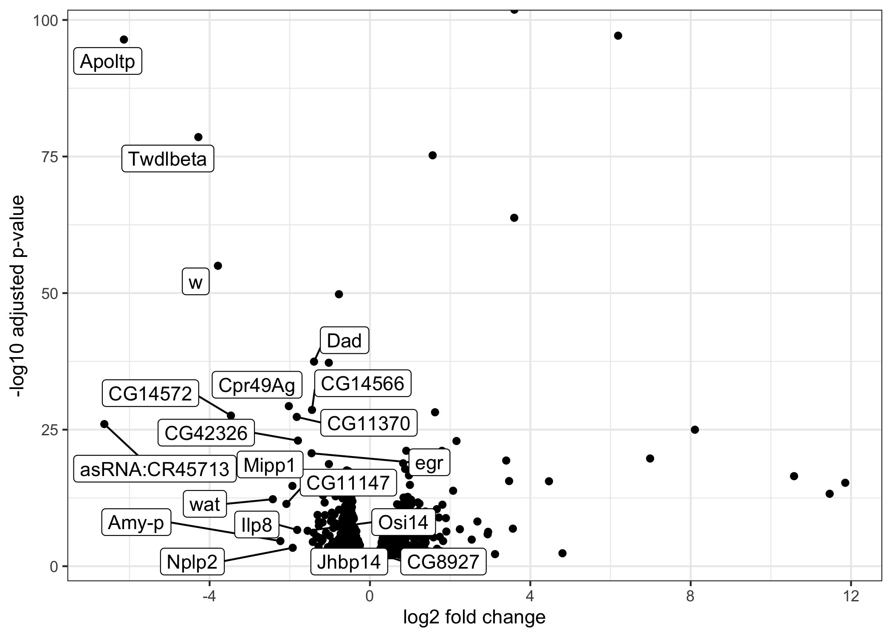
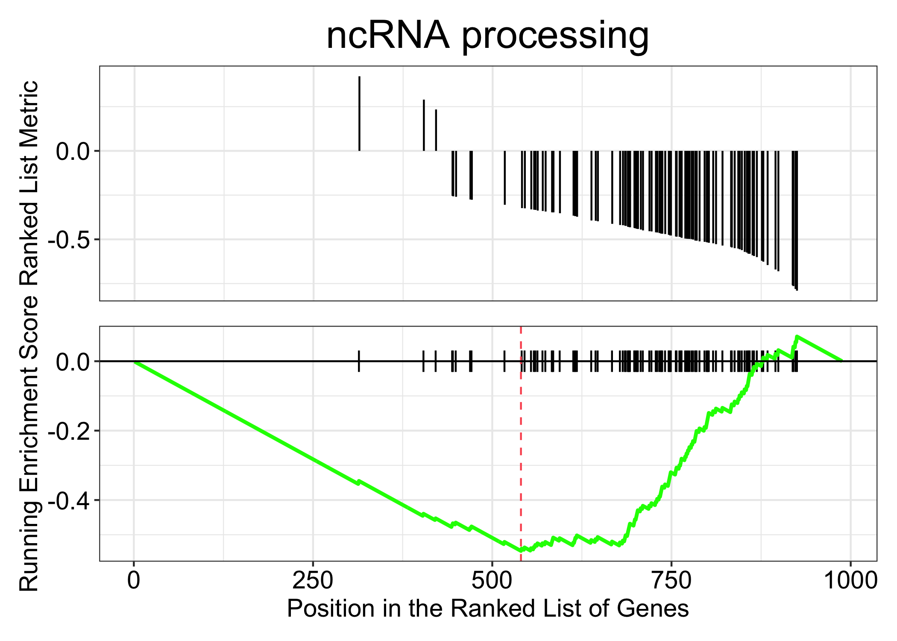
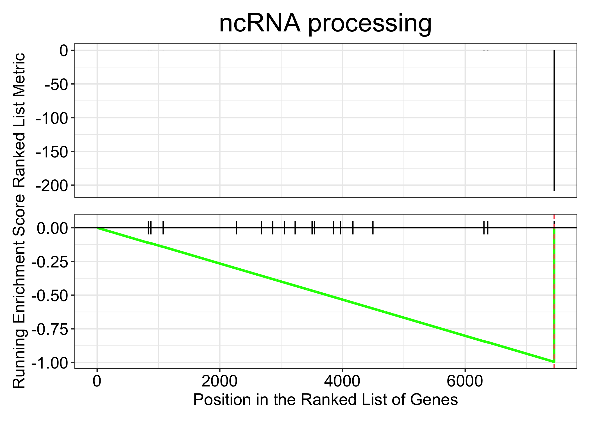

## Introduction

This is RNAseq analysis using deseq2. Two conditions: "control" and "ubi-brk", 3 repeats for each condition.

Experimental setup:

**SalE/PV-ShineGal4\>Brk(x)** – dark control or "control" in this analysis;

**ubi-ShineGal4\>Brk(x)** - 3h light induction of UAS-Brk overexpression, called "ubi-brk" here;

SalE/PV-ShineGal4\>Brk(x) - 3h ight induction of UAS-Brk overexpression in Sal compartment - not included in this analysis due to low number of def expressed genes.

All conditions were processed at the same time with several rounds of sample collection (different days, several crosses). For each repeat 50 discs were combined in one tube (could use up to 35 next time).

## Preparing the data
### Loading libraries


```r
library(DESeq2)
library(apeglm)
library(dplyr)
library(tibble)
library(tidyverse)
library(data.table)
library(ggplot2)
library(ggfortify)
library(ggrepel)
library(RColorBrewer)
library(pheatmap)
library(plotly)
library(magrittr)
library(AnnotationDbi)
library(org.Dm.eg.db)
library(writexl)
```

### Load data

```r
counts <- fread(file ="rsem.merged.gene_counts.tsv", header=TRUE)
sample_info <- read.delim(file = "Data info/RN23010-sampleinfo_full.txt")
```

### Prepare a matrix for DESeq:

Make first column row names, switch to integers, create a matrix object


```r
info<-sample_info %>% column_to_rownames("Sample")
info %>%  filter(Group !='sal-brk') ->ninfo

gcounts <- counts[, -c(2,6:8)]

dt <- as.data.frame(gcounts) %>%
  column_to_rownames("gene_id") 

dt[,1:6] <- lapply(dt[,1:6], as.integer)

mcountdata <- as.matrix(dt) 

has_rownames(dt)
```

```
## [1] TRUE
```

```r
has_rownames(ninfo)
```

```
## [1] TRUE
```

### Matching column order between the tables


```r
all(rownames(ninfo) == colnames(mcountdata))
```

```
## [1] FALSE
```

```r
mcountdata_s <- mcountdata[, rownames(ninfo)]
all(rownames(ninfo) == colnames(mcountdata_s))
```

```
## [1] TRUE
```

### Creating levels for samples.

It will read the first level to be compared with the rest.


```r
ninfo$Group <- factor(ninfo$Group,levels = c("control", "ubi-brk"))
info$Repeat <- as.factor(info$Repeat)
```

## Run deseq.

The object class used by the DESeq2 package to store the read counts and the intermediate estimated quantities during statistical analysis is the **DESeqDataSet**, which will usually be represented in the code here as an object **dds**.


```r
dds <- DESeqDataSetFromMatrix(countData = mcountdata_s,
                              colData = ninfo,
                              design = ~Group)
dds <- DESeq(dds)
res <- results(dds)
sum(res$padj < 0.01 & res$log2FoldChange< (-0.3), na.rm=TRUE)
```

```
## [1] 576
```

```r
resultsNames(dds)
```

```
## [1] "Intercept"                "Group_ubi.brk_vs_control"
```

### Data shrinkage to remove low count data


```r
ubiLFC <- lfcShrink(dds, coef="Group_ubi.brk_vs_control", type="apeglm")
```

```
## using 'apeglm' for LFC shrinkage. If used in published research, please cite:
##     Zhu, A., Ibrahim, J.G., Love, M.I. (2018) Heavy-tailed prior distributions for
##     sequence count data: removing the noise and preserving large differences.
##     Bioinformatics. https://doi.org/10.1093/bioinformatics/bty895
```

```r
plotMA(res, ylim=c(-4,4))
```

<!-- -->

```r
plotMA(ubiLFC, ylim=c(-4,4))
```

<!-- -->
### Converting ubiLFC to a table format with gene names added

```r
ubiLFC %>% 
  as.data.frame() %>% 
  mutate(., gene = mapIds(
  org.Dm.eg.db,
  keys = rownames(.),
  column ="SYMBOL",
  keytype = "FLYBASE",
  multiVals = "first"
)) %>% 
  rownames_to_column(.) %>% 
    mutate(gene = coalesce(gene,rowname)) %>% 
  rename(., ID=rowname) -> ubiLFC_genes
```

```
## 'select()' returned 1:1 mapping between keys and columns
```

### Filtering significantly diff expressed genes 
Padj<001, basemean>100, and arranging according to log2 fold change


```r
ubiLFC_genes %>% 
  filter((padj<0.01) & (baseMean>100)) %>% 
  arrange(log2FoldChange) -> ubiLFC_s
#write_xlsx(ubiLFC_s, "ubi-brk-signif.xlsx")
```

### Removing transposon genes
They are present due to differences in cell lines, as I didnt see them in Sal comparison

```r
ubiLFC_s %>% 
  filter(!stringr::str_detect(ID, "FBti")) ->ubiLFC_s_pel.rm
```

Looking at voclano plot


```r
ggplot(ubiLFC_s_pel.rm, aes(log2FoldChange, -log10(padj))) +
  geom_point() +
  xlab("log2 fold change") + 
        ylab("-log10 adjusted p-value") +
  theme(legend.position = "none", 
              plot.title = element_text(size = rel(1.5), hjust = 0.5), 
              axis.title = element_text(size = rel(1.25))) +
  theme_bw() +
  geom_label_repel(data=head(ubiLFC_s_pel.rm, 20), aes(label=gene), max.overlaps=30)
```

<!-- -->
## Gene set enrichment analysis


```r
# we want the log2 fold change 
original_gene_list <- ubiLFC_s_pel.rm$log2FoldChange

# name the vector
names(original_gene_list) <- ubiLFC_s_pel.rm$gene

# omit any NA values 
gene_list<-na.omit(original_gene_list)

# sort the list in decreasing order (required for clusterProfiler)
gene_list = sort(gene_list, decreasing = TRUE)
```


```r
gse<- gseGO (gene_list,
             ont="BP",
             OrgDb=org.Dm.eg.db,
             keyType="SYMBOL",
             pvalueCutoff = 0.05, 
             verbose = TRUE, 
             minGSSize=3,
             pAdjustMethod = "BH")
```

```
## using 'fgsea' for GSEA analysis, please cite Korotkevich et al (2019).
```

```
## preparing geneSet collections...
```

```
## GSEA analysis...
```

```
## Warning in preparePathwaysAndStats(pathways, stats, minSize, maxSize, gseaParam, : There are ties in the preranked stats (0.2% of the list).
## The order of those tied genes will be arbitrary, which may produce unexpected results.
```

```
## Warning in fgseaMultilevel(pathways = pathways, stats = stats, minSize =
## minSize, : For some of the pathways the P-values were likely overestimated. For
## such pathways log2err is set to NA.
```

```
## Warning in fgseaMultilevel(pathways = pathways, stats = stats, minSize =
## minSize, : For some pathways, in reality P-values are less than 1e-10. You can
## set the `eps` argument to zero for better estimation.
```

```
## leading edge analysis...
```

```
## done...
```

```r
summary(gse) %>% as.tibble() -> gse_sum
```

```
## Warning: `as.tibble()` was deprecated in tibble 2.0.0.
## ℹ Please use `as_tibble()` instead.
## ℹ The signature and semantics have changed, see `?as_tibble`.
## This warning is displayed once every 8 hours.
## Call `lifecycle::last_lifecycle_warnings()` to see where this warning was
## generated.
```

```
## Warning in summary(gse): summary method to convert the object to data.frame is
## deprecated, please use as.data.frame instead.
```

```r
gseaplot(gse, by = "all", title = gse$Description[1], geneSetID = 1)
```

<!-- -->
slim1-more general, slim2 more specific

```r
summary(gse) %>% as.tibble() -> gse_sum
```

```
## Warning in summary(gse): summary method to convert the object to data.frame is
## deprecated, please use as.data.frame instead.
```

```r
gse_sum %>% filter(p.adjust<0.05)
```

```
## # A tibble: 16 × 11
##    ID        Description setSize enrichmentScore   NES   pvalue p.adjust  qvalue
##    <chr>     <chr>         <int>           <dbl> <dbl>    <dbl>    <dbl>   <dbl>
##  1 GO:00344… ncRNA proc…     103          -0.547 -3.01 1   e-10  2.89e-8 2.89e-8
##  2 GO:00422… ribosome b…     107          -0.535 -2.99 1   e-10  2.89e-8 2.89e-8
##  3 GO:00226… ribonucleo…     112          -0.521 -2.93 1   e-10  2.89e-8 2.89e-8
##  4 GO:00160… rRNA metab…      94          -0.533 -2.91 1   e-10  2.89e-8 2.89e-8
##  5 GO:00063… RNA proces…     117          -0.498 -2.79 1   e-10  2.89e-8 2.89e-8
##  6 GO:00346… ncRNA meta…     119          -0.485 -2.76 1   e-10  2.89e-8 2.89e-8
##  7 GO:00063… rRNA proce…      86          -0.537 -2.90 1.60e-10  3.97e-8 3.97e-8
##  8 GO:00440… cellular c…     193          -0.333 -1.96 1.56e- 6  3.37e-4 3.37e-4
##  9 GO:00346… cellular n…     348          -0.264 -1.76 2.10e- 6  4.04e-4 4.04e-4
## 10 GO:00464… heterocycl…     327          -0.261 -1.68 5.00e- 6  8.65e-4 8.65e-4
## 11 GO:00067… cellular a…     331          -0.257 -1.70 6.59e- 6  1.04e-3 1.04e-3
## 12 GO:00422… ribosomal …      36          -0.595 -2.53 8.92e- 6  1.25e-3 1.25e-3
## 13 GO:19013… organic cy…     332          -0.255 -1.67 9.38e- 6  1.25e-3 1.25e-3
## 14 GO:00061… nucleobase…     320          -0.252 -1.61 1.46e- 5  1.80e-3 1.80e-3
## 15 GO:00903… nucleic ac…     288          -0.252 -1.58 1.29e- 4  1.49e-2 1.49e-2
## 16 GO:00422… ribosomal …      34          -0.515 -2.19 4.21e- 4  4.56e-2 4.56e-2
## # ℹ 3 more variables: rank <dbl>, leading_edge <chr>, core_enrichment <chr>
```
### Correct way to do GSEA is to use it on the whole dataset, and then rank according FC*pvalue

```r
ubiLFC_genes %>% 
  mutate(rank_stats=log2FoldChange*-log10(padj)) %>% 
  arrange(desc(rank_stats)) %>% 
  filter(!stringr::str_detect(ID, "FBti") & (baseMean>100)) %>% 
  na.omit() %>% 
  select(gene, rank_stats) %>% 
  mutate(rank_stats=ifelse(is.infinite(rank_stats), 1000, rank_stats)) %>% 
  deframe()-> ubiLFC_rank
```


```r
gse_cor <- gseGO(ubiLFC_rank,
                 ont="BP",
                 OrgDb=org.Dm.eg.db,
                 keyType="SYMBOL",
                 pvalueCutoff = 0.5, 
                 verbose = TRUE, 
                 minGSSize=3,
                 pAdjustMethod = "BH")
```

```
## using 'fgsea' for GSEA analysis, please cite Korotkevich et al (2019).
```

```
## preparing geneSet collections...
```

```
## GSEA analysis...
```

```
## Warning in preparePathwaysAndStats(pathways, stats, minSize, maxSize, gseaParam, : There are ties in the preranked stats (0.56% of the list).
## The order of those tied genes will be arbitrary, which may produce unexpected results.
```

```
## leading edge analysis...
```

```
## done...
```

```r
summary(gse_cor) %>% as.tibble() -> gse_cor.sum
```

```
## Warning in summary(gse_cor): summary method to convert the object to data.frame
## is deprecated, please use as.data.frame instead.
```

```r
gseaplot(gse_cor, by = "all", title = gse$Description[1], geneSetID = 1)
```

<!-- -->


```r
intersect(names(ubiLFC_rank), names(gene_list))
```

```
##   [1] "brk"                          "CG3097"                      
##   [3] "l(2)03659"                    "Cyp6a17"                     
##   [5] "CG31601"                      "mthl8"                       
##   [7] "Gr64a"                        "CG18278"                     
##   [9] "CG7675"                       "CG32318"                     
##  [11] "CG30059"                      "CG11594"                     
##  [13] "CG43333"                      "tinc"                        
##  [15] "ZnT77C"                       "CG13954"                     
##  [17] "bab2"                         "CG11498"                     
##  [19] "CG18853"                      "CG12159"                     
##  [21] "Cpr49Ac"                      "CG32500"                     
##  [23] "tun"                          "CG14257"                     
##  [25] "Cht5"                         "Cpr51A"                      
##  [27] "MESR3"                        "CG4374"                      
##  [29] "CG43394"                      "mthl3"                       
##  [31] "esn"                          "Cyp4e2"                      
##  [33] "CG13737"                      "hid"                         
##  [35] "Nepl3"                        "bib"                         
##  [37] "CAH1"                         "Prx6b"                       
##  [39] "Ypel"                         "Eip78C"                      
##  [41] "AhcyL2"                       "Obp99a"                      
##  [43] "l(2)k05911"                   "Dyro"                        
##  [45] "Sox102F"                      "Ppn"                         
##  [47] "TP53INP"                      "ImpE2"                       
##  [49] "rst"                          "CG14275"                     
##  [51] "ced-6"                        "CG32486"                     
##  [53] "ac"                           "Hsp23"                       
##  [55] "Cht10"                        "glec"                        
##  [57] "sc"                           "Sox14"                       
##  [59] "CG2938"                       "Prx6c"                       
##  [61] "comm"                         "lncRNA:CR33938"              
##  [63] "E(spl)m7-HLH"                 "CG13024"                     
##  [65] "CG6770"                       "CG33978"                     
##  [67] "thw"                          "CG7296"                      
##  [69] "Spn47C"                       "CG1273"                      
##  [71] "Phk-3"                        "firl"                        
##  [73] "tey"                          "whd"                         
##  [75] "wbl"                          "CG43051"                     
##  [77] "scyl"                         "CG10936"                     
##  [79] "nyo"                          "Hsp67Ba"                     
##  [81] "Appl"                         "p130CAS"                     
##  [83] "sca"                          "CG14567"                     
##  [85] "Tl"                           "CG10211"                     
##  [87] "E(spl)m6-BFM"                 "bip1"                        
##  [89] "Adk3"                         "Obp56d"                      
##  [91] "NT1"                          "pdm2"                        
##  [93] "comm2"                        "frm"                         
##  [95] "trn"                          "smal"                        
##  [97] "ome"                          "CG11686"                     
##  [99] "mthl10"                       "obst-B"                      
## [101] "Trim9"                        "pdgy"                        
## [103] "tio"                          "asRNA:CR44119"               
## [105] "E(spl)m4-BFM"                 "unc-13"                      
## [107] "Eip75B"                       "CadN"                        
## [109] "asRNA:CR42547"                "lncRNA:CR45232"              
## [111] "asRNA:CR45485"                "Ocho"                        
## [113] "rudhira"                      "REPTOR-BP"                   
## [115] "Dscam1"                       "br"                          
## [117] "Cyp310a1"                     "Picot"                       
## [119] "Ect3"                         "mdy"                         
## [121] "GV1"                          "sr"                          
## [123] "E(spl)malpha-BFM"             "CG8249"                      
## [125] "CG16700"                      "lncRNA:marge"                
## [127] "yellow-e2"                    "CG3649"                      
## [129] "del"                          "mav"                         
## [131] "CG13676"                      "Ac13E"                       
## [133] "chrb"                         "rdo"                         
## [135] "Ugt317A1"                     "Dh31-R"                      
## [137] "CG11899"                      "GstT3"                       
## [139] "pip"                          "Cpr66D"                      
## [141] "Mdr49"                        "CG17754"                     
## [143] "Rtca"                         "dnr1"                        
## [145] "l(3)72Dp"                     "CG31937"                     
## [147] "neo"                          "Glut1"                       
## [149] "CG9416"                       "Poxn"                        
## [151] "lncRNA:CR45473"               "Fatp2"                       
## [153] "RR48344_transposable_element" "ImpE3"                       
## [155] "LRP1"                         "otk"                         
## [157] "CAH2"                         "Brd"                         
## [159] "CG15628"                      "Mp"                          
## [161] "Dyrk2"                        "bves"                        
## [163] "Spn77Ba"                      "FBgn0029082"                 
## [165] "CG12896"                      "mtgo"                        
## [167] "fok"                          "ImpE1"                       
## [169] "CG10311"                      "CG5618"                      
## [171] "PLCXD"                        "asRNA:CR43944"               
## [173] "CG5151"                       "Cad87A"                      
## [175] "lncRNA:CR42549"               "vri"                         
## [177] "ldd"                          "CG1265"                      
## [179] "cer"                          "Mnn1"                        
## [181] "LManII"                       "teq"                         
## [183] "al"                           "Sqor"                        
## [185] "Pvf2"                         "CG46310"                     
## [187] "magu"                         "Kal1"                        
## [189] "Pka-C3"                       "hng3"                        
## [191] "caps"                         "Samuel"                      
## [193] "CG40160"                      "CG10089"                     
## [195] "CG12643"                      "mlt"                         
## [197] "sli"                          "BBS8"                        
## [199] "CG11170"                      "CG3520"                      
## [201] "CG18135"                      "tna"                         
## [203] "rpr"                          "Argl"                        
## [205] "stx"                          "CG42741"                     
## [207] "Cirl"                         "Den1"                        
## [209] "Zmynd10"                      "CG10948"                     
## [211] "CG16721"                      "Nhe2"                        
## [213] "Sdr"                          "CG32241"                     
## [215] "asRNA:CR45141"                "CG5966"                      
## [217] "tfc"                          "CG8420"                      
## [219] "stw"                          "CG31997"                     
## [221] "CG14301"                      "CG6231"                      
## [223] "CREG"                         "CG42342"                     
## [225] "fend"                         "CG32809"                     
## [227] "CG8389"                       "Kr-h1"                       
## [229] "Rchy1"                        "CG33062"                     
## [231] "Drat"                         "emp"                         
## [233] "Ddr"                          "lncRNA:CR42862"              
## [235] "CG8034"                       "Tig"                         
## [237] "CrebA"                        "Tsf3"                        
## [239] "CG32373"                      "lft"                         
## [241] "CG6959"                       "Hsp27"                       
## [243] "CG9003"                       "Pgant9"                      
## [245] "CG3880"                       "Np"                          
## [247] "Nep2"                         "MFS18"                       
## [249] "Non1"                         "BNIP3"                       
## [251] "MsrA"                         "Lk6"                         
## [253] "CG10657"                      "side-IV"                     
## [255] "myd"                          "Cln7"                        
## [257] "NaCP60E"                      "CG7083"                      
## [259] "bbg"                          "LTV1"                        
## [261] "mrt"                          "Mmp1"                        
## [263] "E(spl)m8-HLH"                 "asRNA:CR44390"               
## [265] "nub"                          "Tina-1"                      
## [267] "NijA"                         "amd"                         
## [269] "Ip6k"                         "Svil"                        
## [271] "lncRNA:CR46450"               "LanA"                        
## [273] "Vdup1"                        "CG15544"                     
## [275] "CG34193"                      "Aldh-III"                    
## [277] "Tmc"                          "ttk"                         
## [279] "CG9689"                       "mura"                        
## [281] "Osi24"                        "Naglu"                       
## [283] "CRAT"                         "Inos"                        
## [285] "CG3328"                       "geko"                        
## [287] "CG17834"                      "wg"                          
## [289] "RR48810_transposable_element" "CG34056"                     
## [291] "lbk"                          "kn"                          
## [293] "Dll"                          "atos"                        
## [295] "CG30460"                      "CG6966"                      
## [297] "CG3603"                       "side-V"                      
## [299] "CG12268"                      "CG7530"                      
## [301] "tkv"                          "CG12299"                     
## [303] "CG34125"                      "CG6163"                      
## [305] "trh"                          "Notum"                       
## [307] "Nubpl"                        "Nadk1a"                      
## [309] "CG2698"                       "CG14598"                     
## [311] "CG17230"                      "CG4364"                      
## [313] "CG1486"                       "Alh"                         
## [315] "gpp"                          "Abp1"                        
## [317] "RhoGAP15B"                    "CG9886"                      
## [319] "luna"                         "eg"                          
## [321] "Invadolysin"                  "RhoU"                        
## [323] "CG17032"                      "Sod3"                        
## [325] "cnc"                          "CG34398"                     
## [327] "RanBPM"                       "CG8818"                      
## [329] "CG6845"                       "Atg6"                        
## [331] "CG16786"                      "Cda4"                        
## [333] "Mnt"                          "bnb"                         
## [335] "CG4313"                       "Sema2b"                      
## [337] "InR"                          "asRNA:CR44690"               
## [339] "CG11275"                      "Aptx"                        
## [341] "Jheh2"                        "CG4766"                      
## [343] "strat"                        "norpA"                       
## [345] "CG17574"                      "Delta"                       
## [347] "mth"                          "cbt"                         
## [349] "chas"                         "CG1607"                      
## [351] "CG3857"                       "Snx21"                       
## [353] "Tom"                          "CG42837"                     
## [355] "CG11961"                      "Sirup"                       
## [357] "Bx"                           "LanB1"                       
## [359] "CG11550"                      "CG3376"                      
## [361] "noc"                          "Fkbp14"                      
## [363] "IP3K2"                        "in"                          
## [365] "CG31075"                      "CG11883"                     
## [367] "Pif1B"                        "Acox57D-p"                   
## [369] "CG42699"                      "Atg4a"                       
## [371] "RapGAP1"                      "CG46306"                     
## [373] "Rcd5"                         "Sema1b"                      
## [375] "CG10283"                      "peg"                         
## [377] "ewg"                          "CG30089"                     
## [379] "CG1316"                       "FBgn0025683"                 
## [381] "l(2)k09913"                   "Sema1a"                      
## [383] "Cerk"                         "CG14478"                     
## [385] "red"                          "vg"                          
## [387] "pix"                          "CG5397"                      
## [389] "CG42806"                      "sei"                         
## [391] "CG2812"                       "Toll-7"                      
## [393] "MED16"                        "Gnptab"                      
## [395] "klar"                         "Myo95E"                      
## [397] "CG11247"                      "GEFmeso"                     
## [399] "RhoGAP5A"                     "CG9902"                      
## [401] "CG1965"                       "CG12075"                     
## [403] "phr6-4"                       "svr"                         
## [405] "Ip259"                        "Tet"                         
## [407] "Ten-m"                        "for"                         
## [409] "Oseg1"                        "Rfx"                         
## [411] "CG1233"                       "CG5674"                      
## [413] "Taf6"                         "Ptp69D"                      
## [415] "CG42663"                      "mxt"                         
## [417] "Rab4"                         "olf413"                      
## [419] "Ist1"                         "FBgn0026749"                 
## [421] "Rm62"                         "raskol"                      
## [423] "Orai"                         "Idh"                         
## [425] "Rpn10"                        "caz"                         
## [427] "Nasp"                         "Prosalpha3"                  
## [429] "spoon"                        "Hrb98DE"                     
## [431] "Rpn2"                         "alphaTub84B"                 
## [433] "CG8635"                       "Scsalpha1"                   
## [435] "Trx2"                         "SdhD"                        
## [437] "Rbf"                          "mEFTs"                       
## [439] "Pfdn6"                        "fzy"                         
## [441] "Aos1"                         "CG9300"                      
## [443] "CG9630"                       "AsnRS"                       
## [445] "CG1463"                       "Pdhb"                        
## [447] "wuho"                         "nesd"                        
## [449] "Rat1"                         "Cchl"                        
## [451] "psidin"                       "lncRNA:CR44334"              
## [453] "RIOK2"                        "sofe"                        
## [455] "Polr2E"                       "Ntan1"                       
## [457] "Prx6a"                        "Gar1"                        
## [459] "HIP"                          "PolA1"                       
## [461] "tum"                          "Sps1"                        
## [463] "CG8149"                       "CG5757"                      
## [465] "CysRS"                        "roh"                         
## [467] "COX5B"                        "CG4069"                      
## [469] "CG3847"                       "CCT3"                        
## [471] "Caf1-180"                     "ttm50"                       
## [473] "mRpL12"                       "CG32075"                     
## [475] "bonsai"                       "CG3817"                      
## [477] "CG8097"                       "alpha-PheRS"                 
## [479] "msk"                          "eIF3j"                       
## [481] "ATPsynCF6"                    "Rpt4"                        
## [483] "sob"                          "CG12128"                     
## [485] "Cbs"                          "Idh3b"                       
## [487] "Mcm2"                         "CG14174"                     
## [489] "AIMP2"                        "vig2"                        
## [491] "Cox10"                        "CG9281"                      
## [493] "Nxt1"                         "blw"                         
## [495] "Nost"                         "CG11444"                     
## [497] "salr"                         "CG14543"                     
## [499] "CCT4"                         "mRpS10"                      
## [501] "AIMP3"                        "GC1"                         
## [503] "Prat"                         "CG3760"                      
## [505] "Smyd5"                        "ATPsynD"                     
## [507] "dve"                          "mRpL32"                      
## [509] "Nup107"                       "Naa15-16"                    
## [511] "Prp19"                        "Prosalpha1R"                 
## [513] "Kank"                         "aralar1"                     
## [515] "Men-b"                        "Pdha"                        
## [517] "Ogdh"                         "CG13630"                     
## [519] "CG3527"                       "vito"                        
## [521] "Nuf2"                         "porin"                       
## [523] "melt"                         "Rpt5"                        
## [525] "Prps"                         "SerRS"                       
## [527] "CG11417"                      "CG9095"                      
## [529] "Chrac-14"                     "muc"                         
## [531] "RecQ4"                        "RfC38"                       
## [533] "CG6769"                       "RanGAP"                      
## [535] "twe"                          "Adk2"                        
## [537] "CG9004"                       "Cdc6"                        
## [539] "Pfdn2"                        "Tom20"                       
## [541] "CG8003"                       "Ote"                         
## [543] "Gnf1"                         "ND-ACP"                      
## [545] "pav"                          "Rrp42"                       
## [547] "Vha26"                        "Idh3a"                       
## [549] "P32"                          "Lsd-2"                       
## [551] "RnpS1"                        "CG34132"                     
## [553] "CG9338"                       "Acat1"                       
## [555] "sgg"                          "CG11164"                     
## [557] "beta-PheRS"                   "CG12134"                     
## [559] "CG8326"                       "Fs(2)Ket"                    
## [561] "Adsl"                         "kra"                         
## [563] "CG10337"                      "Mtr4"                        
## [565] "CG14207"                      "Dbp73D"                      
## [567] "ckd"                          "form3"                       
## [569] "Ipo9"                         "Prp3"                        
## [571] "dpa"                          "Dph5"                        
## [573] "CG10576"                      "mRpL52"                      
## [575] "drm"                          "UQCR-C2"                     
## [577] "RnrS"                         "Psc"                         
## [579] "PolD1"                        "CG8891"                      
## [581] "borr"                         "CG11583"                     
## [583] "CG42455"                      "CG15717"                     
## [585] "Noc3"                         "yellow-c"                    
## [587] "CG14683"                      "CG46459"                     
## [589] "CG9107"                       "SdhB"                        
## [591] "Hpf1"                         "cwo"                         
## [593] "Rexo5"                        "Adck1"                       
## [595] "CG8441"                       "D2hgdh"                      
## [597] "Cdc45"                        "MFS10"                       
## [599] "mus301"                       "Nmt"                         
## [601] "Pop1"                         "mRpS30"                      
## [603] "CG10565"                      "FBgn0052226"                 
## [605] "CG9393"                       "CG9286"                      
## [607] "CG44838"                      "ValRS"                       
## [609] "RanBP3"                       "CG4806"                      
## [611] "CG11050"                      "CCT8"                        
## [613] "Shmt"                         "Tcs1"                        
## [615] "Polr3K"                       "blow"                        
## [617] "Sms"                          "Mcm7"                        
## [619] "aurB"                         "CG34231"                     
## [621] "RPA1"                         "Phb1"                        
## [623] "CG11030"                      "Chd3"                        
## [625] "WRNexo"                       "CCT5"                        
## [627] "CG7841"                       "CG42588"                     
## [629] "Csl4"                         "wds"                         
## [631] "eIF2beta"                     "mge"                         
## [633] "Nup58"                        "CCT7"                        
## [635] "RnrL"                         "ko"                          
## [637] "128up"                        "l(2)05287"                   
## [639] "Uch-L5"                       "CG8630"                      
## [641] "Aatf"                         "Mdh2"                        
## [643] "CG15027"                      "dbe"                         
## [645] "CG11180"                      "CG45085"                     
## [647] "feo"                          "Polr1B"                      
## [649] "l(3)72Dn"                     "Polr1F"                      
## [651] "pont"                         "bero"                        
## [653] "CG4593"                       "CG14805"                     
## [655] "PolD2"                        "CG31875"                     
## [657] "CycB"                         "CG14230"                     
## [659] "Rtc1"                         "CG10336"                     
## [661] "Drep2"                        "CG4975"                      
## [663] "C15"                          "zuc"                         
## [665] "CG5214"                       "Ns1"                         
## [667] "Rrp45"                        "CG7966"                      
## [669] "Ts"                           "CG33509"                     
## [671] "Cmpk"                         "BckdhA"                      
## [673] "Atf3"                         "wun2"                        
## [675] "Ttd14"                        "MRP"                         
## [677] "nero"                         "Fen1"                        
## [679] "DAAM"                         "Pfdn5"                       
## [681] "Mnr"                          "esc"                         
## [683] "pnut"                         "Phb2"                        
## [685] "CG11076"                      "Mcm3"                        
## [687] "Chchd2"                       "CG9593"                      
## [689] "PolE1"                        "l(1)G0004"                   
## [691] "Ski6"                         "Rs1"                         
## [693] "HipHop"                       "T3dh"                        
## [695] "so"                           "Sdb"                         
## [697] "CG8012"                       "Hsp60A"                      
## [699] "kz"                           "Polr1C"                      
## [701] "cutlet"                       "sle"                         
## [703] "dpn"                          "CG8206"                      
## [705] "sordd2"                       "CG32267"                     
## [707] "pths"                         "CG15093"                     
## [709] "CG5290"                       "Chd64"                       
## [711] "Dus3"                         "CG32694"                     
## [713] "CG31808"                      "Phf7"                        
## [715] "DNAlig1"                      "CG11837"                     
## [717] "CycB3"                        "Ude"                         
## [719] "CG11123"                      "rept"                        
## [721] "Nph"                          "Mgstl"                       
## [723] "Pus1"                         "CG11267"                     
## [725] "Mcm6"                         "CG4554"                      
## [727] "Naa40"                        "CG2691"                      
## [729] "Sox100B"                      "bys"                         
## [731] "Nop10"                        "Nup54"                       
## [733] "bora"                         "Doc3"                        
## [735] "RfC4"                         "mEFG1"                       
## [737] "Tg"                           "dysf"                        
## [739] "CG6739"                       "CG3594"                      
## [741] "RNaseZ"                       "Mcm5"                        
## [743] "CG18273"                      "bsf"                         
## [745] "CG18178"                      "Imp"                         
## [747] "CG13893"                      "CG1572"                      
## [749] "Hmbs"                         "Orc2"                        
## [751] "CG7054"                       "Pus7"                        
## [753] "l(2)k09022"                   "Rrp5"                        
## [755] "opa"                          "PolE2"                       
## [757] "RIOK1"                        "ND5"                         
## [759] "NO66"                         "l(2)34Fd"                    
## [761] "mod"                          "vig"                         
## [763] "Nmdmc"                        "CG7884"                      
## [765] "CCT1"                         "CG1703"                      
## [767] "Art1"                         "FBgn0032906"                 
## [769] "Polr1E"                       "Ntf-2"                       
## [771] "lncRNA:CR43264"               "Tret1-1"                     
## [773] "CCT2"                         "mei-38"                      
## [775] "Prim1"                        "Trmt61"                      
## [777] "ais"                          "Doc1"                        
## [779] "Roe1"                         "Nt5a"                        
## [781] "ras"                          "CG15879"                     
## [783] "CG6712"                       "san"                         
## [785] "Cadps"                        "MtnA"                        
## [787] "CG8611"                       "Hex-A"                       
## [789] "Tsr1"                         "Ctps"                        
## [791] "Polr1A"                       "Nsun5"                       
## [793] "CG3430"                       "Rcd6"                        
## [795] "CG8064"                       "Mcm10"                       
## [797] "fru"                          "eEF1delta"                   
## [799] "Art8"                         "Ctf4"                        
## [801] "FBgn0030170"                  "Art3"                        
## [803] "Hsp110"                       "CG7246"                      
## [805] "ATP6"                         "ppan"                        
## [807] "CG9752"                       "CG7006"                      
## [809] "RFeSP"                        "Nop60B"                      
## [811] "Rrp46"                        "Non3"                        
## [813] "Mat89Ba"                      "CG12325"                     
## [815] "CG9799"                       "CG6937"                      
## [817] "CG32512"                      "CG13097"                     
## [819] "AdamTS-B"                     "CG10286"                     
## [821] "Hs6st"                        "tup"                         
## [823] "CG17734"                      "Idgf3"                       
## [825] "CG10903"                      "Mys45A"                      
## [827] "indra"                        "CG3902"                      
## [829] "GstE7"                        "l(3)07882"                   
## [831] "Pdp1"                         "mRpL18"                      
## [833] "CG18789"                      "CG11089"                     
## [835] "PCNA"                         "CG10341"                     
## [837] "mRpL44"                       "eIF6"                        
## [839] "CG32409"                      "CG8026"                      
## [841] "Cyt-c1"                       "CG5800"                      
## [843] "FBgn0034496"                  "BthD"                        
## [845] "pnr"                          "PCB"                         
## [847] "CG43103"                      "Ak3"                         
## [849] "CG2972"                       "Adss"                        
## [851] "CG11980"                      "Ns3"                         
## [853] "PolA2"                        "Noc1"                        
## [855] "CG13690"                      "CG14984"                     
## [857] "CG9932"                       "CG12288"                     
## [859] "nudC"                         "l(1)G0020"                   
## [861] "SoYb"                         "CG11563"                     
## [863] "CG9922"                       "ND1"                         
## [865] "Nsun2"                        "La"                          
## [867] "Aldh"                         "nop5"                        
## [869] "CG11779"                      "CG12499"                     
## [871] "CG6073"                       "CG7728"                      
## [873] "wcd"                          "CG2260"                      
## [875] "Bcat"                         "CG30349"                     
## [877] "CG32281"                      "upd3"                        
## [879] "CG32344"                      "CG6724"                      
## [881] "Rif1"                         "alphaTub84D"                 
## [883] "mbm"                          "CG3226"                      
## [885] "Droj2"                        "Hsc70-5"                     
## [887] "CycE"                         "CG8545"                      
## [889] "Zpr1"                         "CG1542"                      
## [891] "U3-55K"                       "CG3071"                      
## [893] "CG1785"                       "Noc2"                        
## [895] "CG13067"                      "SCaMC"                       
## [897] "Cyp4p1"                       "Surf6"                       
## [899] "Dif"                          "Nle"                         
## [901] "AsnS"                         "Prim2"                       
## [903] "CG9815"                       "Nnp-1"                       
## [905] "Nmd3"                         "Fkbp39"                      
## [907] "CG7182"                       "RpLP0-like"                  
## [909] "Rbm13"                        "CG5114"                      
## [911] "ITP"                          "bor"                         
## [913] "Gasp"                         "phr"                         
## [915] "chinmo"                       "Claspin"                     
## [917] "peng"                         "Jhbp14"                      
## [919] "Socs36E"                      "Tsp42El"                     
## [921] "pit"                          "CG5033"                      
## [923] "Nplp2"                        "Arc1"                        
## [925] "upd1"                         "CG46385"                     
## [927] "Sas10"                        "CG13082"                     
## [929] "rau"                          "CG17190"                     
## [931] "DnaJ-1"                       "CG12301"                     
## [933] "ana2"                         "r-l"                         
## [935] "kdn"                          "Nplp4"                       
## [937] "ab"                           "CG3085"                      
## [939] "CG10863"                      "vn"                          
## [941] "CG8927"                       "l(2)09851"                   
## [943] "Nopp140"                      "nclb"                        
## [945] "CG45071"                      "SpdS"                        
## [947] "CG8939"                       "CG13096"                     
## [949] "Cyp4p2"                       "CG34325"                     
## [951] "CG15629"                      "Nop56"                       
## [953] "dup"                          "Osi14"                       
## [955] "NHP2"                         "Amy-p"                       
## [957] "Jhbp7"                        "spz5"                        
## [959] "CR40190"                      "Cyt-c-p"                     
## [961] "Ilp8"                         "CG12909"                     
## [963] "Uhg1"                         "Mybbp1A"                     
## [965] "hoip"                         "prage"                       
## [967] "CG46339"                      "CG13516"                     
## [969] "stg"                          "CG3961"                      
## [971] "bi"                           "CG4115"                      
## [973] "CG11147"                      "Mipp1"                       
## [975] "wat"                          "egr"                         
## [977] "Hsp83"                        "FBgn0267727"                 
## [979] "CG42326"                      "CG14566"                     
## [981] "CG11370"                      "Dad"                         
## [983] "Cpr49Ag"                      "CG14572"                     
## [985] "asRNA:CR45713"                "w"                           
## [987] "Twdlbeta"                     "Apoltp"
```

